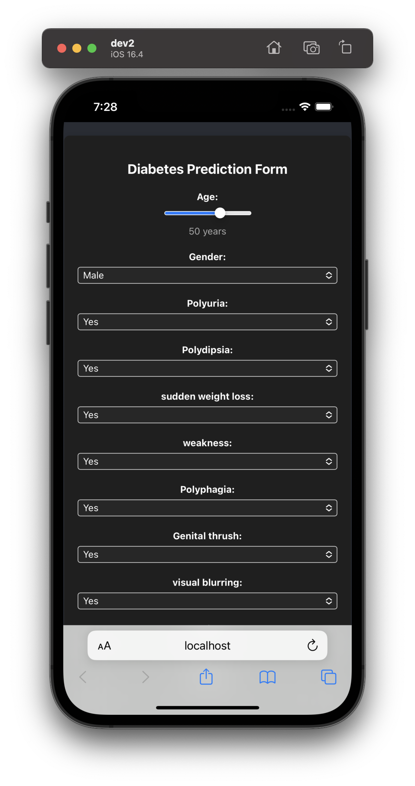
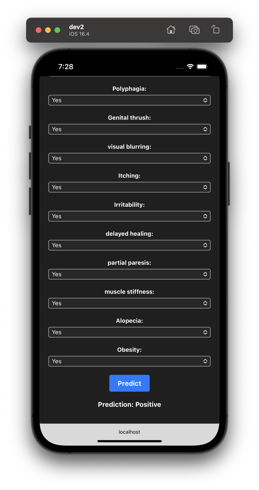
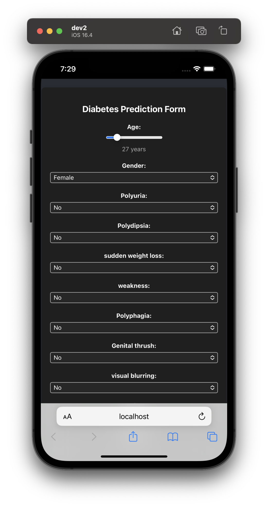
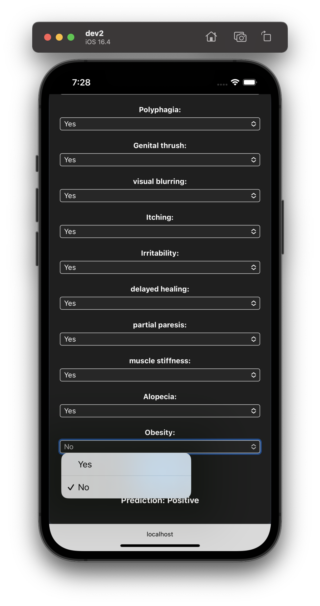

# Early Stage Diabetes Prediction

## Documentation

[Data Source Citation](CITATION.md)

## Paper
Codebase for _DISEASE & SYMPTOM BASED MACHINE LEARNING MODEL & SOFTWARE FOR PERSONALISED DIABETES PREDICTION_

## Tech Stack


## Run Locally

Clone the project

```bash
  git clone https://github.com/Rajkanwars15/diabetes-pred_uci
```

Go to the project directory

```bash
  cd diabetes-pred_uci
```

Make sure you have Python 3.10, FastAPI and NPM

In the project directory, run
```bash
  uvicorn app:app --host 0.0.0.0 --port 8000 
```
Then
```bash
  cd diabetes-prediction-frontend
  npm start
```
Now head over to http://localhost:3000 to test the app.

## App


iOS Yes             |  iOS No
:-------------------------:|:-------------------------:
  |  



## License

[GNU General Public License (GPL)](LICENSE.md)


## Authors

[
  ](https://www.github.com/rajkanwars15)
[
  ](https://www.github.com/anirudh8092)